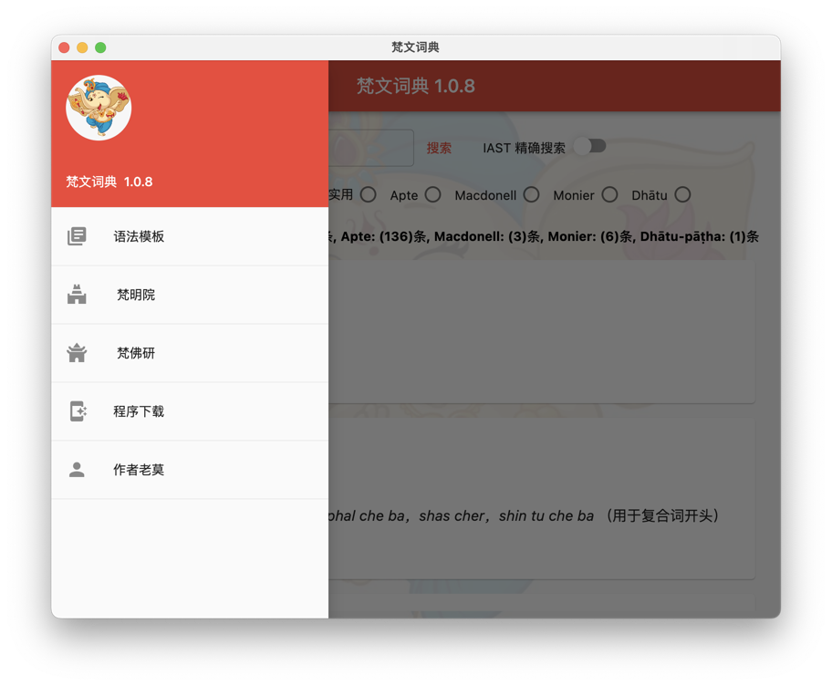
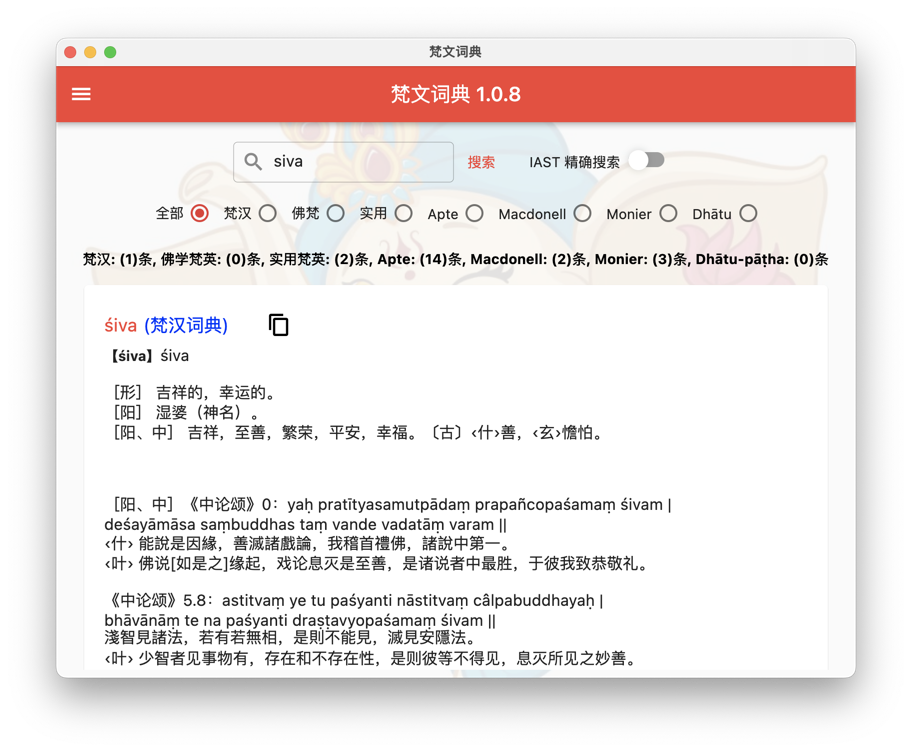

# sanskrit 1.0.4

<!-- PROJECT LOGO -->
 

  <h3 align="center">梵文词典</h3>

<!-- ABOUT THE PROJECT -->
## 关于程序

Mac, Windows 方便快捷的梵文词典:

本程序包含幾十萬單詞，可以不用聯網離線查詢。

內置六大梵英字典，
* Apte
* Macdonell
* Monier
* 梵漢詞匯
* 佛學梵英詞典（Buddhist Hybrid Sanskrit (1953) 詞典）
* 實用梵英詞典（Practical Sanskrit-English）

本程序包含幾十萬單詞，可以不用聯網離線查詢。

<!-- Money -->
## 给老莫打赏

<!-- CONTACT -->
## 联系方式

我的社交帐号:

* 新浪微博: 玄谈莫测 - [新浪微博: 玄谈莫测](https://weibo.com/omjyotish)
* 微信公号: 玄妙莫测
* 微信视频: 与神交流
* 我的知乎:    老莫 - [我的知乎:    老莫](https://www.zhihu.com/people/eiffelqiu)
* 我的B站:    老莫 - [我的B站:    老莫的乐道](https://space.bilibili.com/11070763/dynamic)
* 我的邮箱: jyoti.fun &nbsp; @&nbsp; hotmail.com
* 该程序永久网址: [https://github.com/jyotifun/sanskrit](https://github.com/jyotifun/sanskrit)

